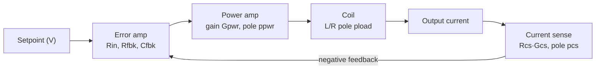

# Scripts & Calculators — Math Reference

Analysis and design scripts for the linear shim amplifier. Each MATLAB/Octave
script (`.m`) now has an equivalent Python port (`.py`) with identical math;
this document explains the underlying theory so the numbers can be reproduced
and audited.

| Topic | MATLAB | Python |
| --- | --- | --- |
| Control-loop compensation design | `compensation.m` | `compensation.py` |
| Closest standard component value | `closest_value.m` | `closest_value.py` |
| DAC reconstruction-filter simulation | `dac_reconstruction_filter.m` | `dac_reconstruction_filter.py` |

## Running

**Octave/MATLAB:** the two control scripts need the Octave-Forge/MATLAB
`control` package (`pkg load control`). Run `compensation` or
`dac_reconstruction_filter` directly.

**Python:** the ports use [`numpy`](https://numpy.org),
[`matplotlib`](https://matplotlib.org), and
[python-control](https://python-control.readthedocs.io). A repo-local virtual
environment is the easiest setup:

```sh
python3 -m venv .venv                       # from the repo root
.venv/bin/python -m pip install numpy matplotlib control
.venv/bin/python "docs/scripts, calculators/compensation.py"
```

(`.venv/` is git-ignored.) `closest_value.py` is imported by
`compensation.py`, so keep them in the same folder.

---

## Conventions

- Poles and zeros are expressed as angular frequencies $\omega$ in rad/s; a
  pole at frequency $f$ Hz is $\omega = 2\pi f$.
- A first-order low-pass stage with pole $p$ (rad/s) has transfer function
  $H(s) = \dfrac{p}{s + p}$, i.e. unity DC gain.
- `zpk(z, p, k)` builds $H(s) = k\,\dfrac{\prod_i (s - z_i)}{\prod_j (s - p_j)}$
  with a **non-normalized** gain $k$. To turn a DC/passband gain $G$ into the
  `zpk` gain, multiply by the pole/zero magnitude ratio:

$$
k = G \cdot \frac{\prod_j |p_j|}{\prod_i |z_i|}.
$$

This is why the scripts write, e.g.,
`fwd_gain = (...passband gain...) * prod(abs(fwd_poles(2:end)))/prod(abs(fwd_zeros))`
(the pole at the origin is excluded from the product because $|0|$ would zero
out the gain — it is a true integrator and carries no finite magnitude scaling).

---

## `compensation` — current-driver loop compensation

Designs the error-amplifier compensation (`Rin`, `Cfbk`) for a given shim
coil, then reports stability margins and transient response. The user supplies
the measured coil resistance `Rload` and inductance `Lload` (including cabling,
measured at 10–100 kHz).

### Plant model

The current-control loop is split into a forward path (error amp → output
current) and a feedback path (output current → error-amp input):



**Load pole (L/R).** The coil is an inductor `Lload` in series with
`Rload + 2·Rcs` (two current-sense resistors in the loop), giving a single real
pole:

$$
p_\text{load} = \frac{R_\text{load} + 2 R_\text{cs}}{L_\text{load}}
\quad[\text{rad/s}].
$$

**Forward path** (poles/zeros, rad/s):

- integrator at the origin (the error-amp/compensator DC gain),
- compensator zero $z_\text{EA}$ (set below),
- error-amp finite-bandwidth pole $p_\text{EABW} = \dfrac{2\pi \cdot \text{GBP}}{1 + R_\text{fbk}/R_\text{in}}$,
- parasitic PCB feedback-capacitance pole $p_\text{Cpcb} = \dfrac{1}{R_\text{fbk} C_\text{pcb}}$,
- power-amp pole $p_\text{pwr}$,
- load pole $p_\text{load}$,
- `Vout_cmd` filter pole $p_\text{filt} = \dfrac{1}{R_\text{filt} C_\text{filt}}$.

The forward passband gain (before the `zpk` magnitude conversion) is

$$
G_\text{fwd} = \frac{1}{R_\text{in} C_\text{fbk}} \cdot 2 G_\text{pwr}
\cdot \frac{1}{R_\text{load} + 2 R_\text{cs}}.
$$

**Feedback path**: current-sense gain $R_\text{cs} G_\text{cs}$ with a single
pole $p_\text{cs}$.

The open-loop transfer function `OL_sys = fwd·bck` is used for stability; the
closed-loop `CL_sys = fwd/(1 + fwd·bck)` is used for the transient response.

### Compensator design rules

**Zero placement.** The compensator zero is set a fixed ratio above the load
pole (to boost phase near crossover), capped at `zero_max`:

$$
z_\text{EA} = \min\!\left(p_\text{load}\cdot k_\text{zero},\; \omega_\text{zero,max}\right),
\qquad
C_\text{fbk} = \max\!\left(\frac{1}{z_\text{EA} R_\text{fbk}},\; C_\text{fbk,min}\right).
$$

**Gain (`Rin`) selection.** For frequencies above $z_\text{EA}$ the error-amp
noise gain is $\approx 1 + R_\text{fbk}/R_\text{in}$ and the loop has a clean
$-20$ dB/decade rolloff, so crossover frequency scales linearly with gain:

$$
f_c = f_{c,\text{base}} \cdot \frac{R_\text{load,base}}{R_\text{load}}
\cdot \frac{R_\text{in,base}}{R_\text{in}}
\cdot \frac{C_\text{fbk,base}}{C_\text{fbk}}.
$$

`Rin` is chosen to hold $f_c$ roughly constant across coils, but is
lower-bounded so the error-amp bandwidth doesn't erode phase margin. Requiring
the amp gain $1 + R_\text{fbk}/R_\text{in}$ to stay below
$\text{GBP} / (f_c \cdot k_\text{EABW})$ yields a quadratic in `Rin`; the script
takes its positive root (`Rin_min_EABW`) and then

$$
R_\text{in} = \max\!\left(
R_\text{in,base}\frac{R_\text{load,base}}{R_\text{load}}\frac{C_\text{fbk,base}}{C_\text{fbk}},\;
R_\text{in,min},\;
R_\text{in,min,EABW}\right).
$$

**Max load capacitance.** A capacitor across the coil forms an LC resonance
with `Lload`; keeping that resonance at least `crossover_loadres_mult`×
above crossover bounds it:

$$
C_\text{load,max} = \frac{1}{\left(2\pi f_c \cdot k_\text{res}\right)^2 L_\text{load}}.
$$

### Outputs

- Printed: `Rin`/`Cfbk` totals and nearest standard values, max load
  capacitance, **phase margin** and **gain margin** (from `margin(OL_sys)`),
  each pole/zero frequency, and 1 %/0.1 % step-settling times.
- Plots: open-loop gain/phase (with 0 dB, margin, crossover, and zero-phase
  markers), closed-loop frequency response, and the step response with/without
  a setpoint low-pass filter.

---

## `closest_value` — nearest standard component

Picks the standard-series component that best hits a target, allowing a fixed
series and a fixed parallel element around the swappable part:

$$
\text{val} = \text{val}_\text{series} + \left(\text{choice} \parallel \text{val}_\text{parallel}\right),
\qquad
a \parallel b = \frac{1}{\tfrac{1}{a} + \tfrac{1}{b}}.
$$

The candidate set is the per-decade mantissa list (e.g. E12/E24) expanded
across `decade_range`, bracketed by `0` (a short for R/L, an open for C) and
`∞` (an open for R/L, a short for C). The routine returns the candidate
minimizing the **relative** error

$$
\varepsilon = \min_\text{choice}
\left|\frac{\text{val}_\text{total}(\text{choice}) - \text{val}}{\text{val}}\right|.
$$

Standard mantissa rows are defined inline in `compensation`: `E12` for
capacitors, `E24` for resistors.

---

## `dac_reconstruction_filter` — output-filter simulation

Shows how a 2-pole analog reconstruction filter smooths the stepped output of a
DAC. Parameters: two identical real poles (default 16 kHz), a test sinewave
(default 5 kHz), and the DAC update period (default 20 µs).

**DAC (zero-order hold).** The ideal sinewave is sampled and held at
`dac_timestep`, evaluated at the middle of each hold interval:

$$
x_\text{dac}(t) = \sin\!\Big(2\pi f\big(t - (t \bmod T_\text{dac}) + \tfrac{T_\text{dac}}{2}\big)\Big).
$$

**Filter.** $H(s) = \dfrac{p_1 p_2}{(s - p_1)(s - p_2)}$ (unity DC gain), applied
to both the stepped DAC output and an ideal continuous sinewave via
`lsim`/`forced_response`. The normalized error is
$(y_\text{real} - y_\text{ideal}) / \max(y_\text{ideal})$.

**Analytic check.** For two coincident real poles at $f_p$, evaluated at $f$:

$$
|H| = \frac{1}{1 + (f/f_p)^2},
\qquad
\angle H = -2\arctan\!\frac{f}{f_p}.
$$

With $f = 5$ kHz, $f_p = 16$ kHz this gives $|H| \approx 0.911$
(≈8.9 % attenuation) and a $\approx 34.7°$ delay — matching the script's
printed output.

---

## Porting notes (MATLAB → Python)

| MATLAB / `control` | Python (`control` = `ct`) |
| --- | --- |
| `zpk(z, p, k)` | `ct.zpk(z, p, k)` |
| `series(a, b)`, `feedback(a, b)` | `ct.series`, `ct.feedback` |
| `margin(sys)` | `ct.margin(sys)` |
| `step(sys)` | `ct.step_response(sys)` (returns `t, y`) |
| `lsim(sys, u, t)` | `ct.forced_response(sys, T=t, U=u)` |
| `freqresp(sys, w)` | `ct.frequency_response(sys, w).frdata` |
| `mag2db(x)` | `20*np.log10(x)` |
| `roots([...])` | `np.roots([...])` |
| `logspace`, `unwrap`, `angle` | `np.logspace`, `np.unwrap`, `np.angle` |

The scalar results (all poles/zeros, `Rin`, `Cfbk`, settling values) were
cross-checked against the original Octave script and agree to full precision.
